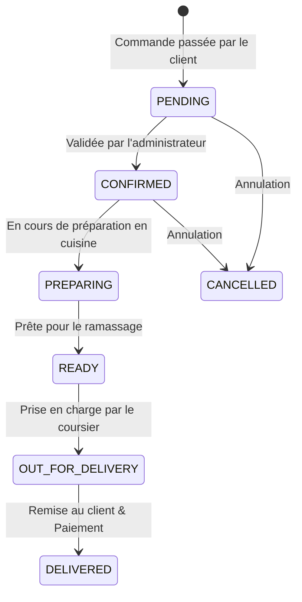

# 🛵 Quick Livraison — Application Mobile de Livraison (Style Glovo)

> **Quick Livraison** est une application mobile complète de commande et de livraison à domicile (repas de restaurants, courses de supermarché, boutiques et colis express), optimisée pour le marché marocain (ville pilote : **Oujda**) et extensible à d'autres villes.

Développée avec **React Native**, **Expo**, **TypeScript** et propulsée par **Supabase**, elle propose une double expérience fluide : une interface **Client** intuitive inspirée des standards internationaux (Glovo, Uber Eats) et un panneau d'administration **Admin** temps réel pour le suivi opérationnel et la gestion de flotte.

---

## 📑 Table des Matières

1. [Aperçu & Philosophie du Projet](#-aperçu--philosophie-du-projet)
2. [Stack Technologique](#-stack-technologique)
3. [Fonctionnalités Principales](#-fonctionnalités-principales)
   - [Espace Client](#-espace-client)
   - [Espace Administrateur](#-espace-administrateur)
   - [Mode Démo Intégré](#-mode-démo-intégré-zéro-friction)
4. [Architecture du Code](#-architecture-du-code)
   - [Arborescence des Dossiers](#arborescence-des-dossiers)
   - [Système de Routage (Expo Router)](#système-de-routage-expo-router)
   - [Gestion des Données & Services (State Management)](#gestion-des-données--services-state-management)
5. [Installation & Démarrage Rapide](#-installation--démarrage-rapide)
6. [Comptes de Test (Identifiants Démo)](#-comptes-de-test-identifiants-démo)
7. [Base de Données & Configuration Supabase](#-base-de-données--configuration-supabase)
   - [Configuration du Client](#configuration-du-client)
   - [Scripts SQL & Migrations](#scripts-sql--migrations)
   - [Modèle de Données (Schéma Relationnel)](#modèle-de-données-schéma-relationnel)
8. [Flux Métier : Cycle de Vie d'une Commande](#-flux-métier--cycle-de-vie-dune-commande)
9. [Conventions de Code & Règles d'Or](#-conventions-de-code--règles-dor)
10. [Dépannage & FAQ](#-dépannage--faq)

---

## 🎯 Aperçu & Philosophie du Projet

Le projet a été pensé pour être :
* **Prêt à l'emploi (Zero Setup Barrier)** : Fonctionne immédiatement en mode démo avec des données locales riches même sans connexion Supabase active.
* **Robuste & Isomorphe** : Compatible **Android**, **iOS** et **Web (navigateur)** sans régression d'interface.
* **Léger & Sans Backend Lourd** : Pas de serveur Express/NestJS intermédiaire. Supabase gère l'authentification, la persistance PostgreSQL, le stockage et les websockets temps réel.
* **Adapté au Contexte Local** : Devise en Dirham marocain (DH / MAD), sélection des quartiers réels d'Oujda (Hay Al Qods, Lazaret, Centre-Ville, etc.), moyens de paiement adaptés (Espèces à la livraison, Virement, Carte).

---

## 🛠 Stack Technologique

| Domaine | Technologies | Rôle & Justification |
| :--- | :--- | :--- |
| **Framework Mobile** | [React Native](https://reactnative.dev/) + [Expo](https://expo.dev/) (SDK 54) | Développement cross-platform natif rapide et performant. |
| **Langage** | [TypeScript](https://www.typescriptlang.org/) (Strict Mode) | Typage statique fort pour sécuriser le code et documenter les structures de données. |
| **Routage** | [Expo Router](https://docs.expo.dev/router/introduction/) v6 | Routage basé sur le système de fichiers (File-based Routing), Deep Linking et Route Groups. |
| **BaaS / Base de données** | [Supabase](https://supabase.com/) | PostgreSQL hébergé, authentification JWT, Row Level Security (RLS) et Realtime Channels. |
| **Stockage Local** | `expo-secure-store` / `localStorage` | Persistance sécurisée des sessions et cache offline selon la plateforme (Mobile/Web). |
| **UI & Animations** | `react-native-reanimated`, `react-native-safe-area-context` | Composants UI personnalisés et animations fluides. |
| **Géolocalisation & Cartes** | `expo-location` + Module GPS interactif | Simulation haute précision du trajet coursier rue par rue. |

---

## ✨ Fonctionnalités Principales

### 👤 Espace Client

1. **Écran d'Accueil (Glovo Hub)** :
   - Sélecteur de quartier de livraison avec géolocalisation GPS automatique ou manuelle (20+ quartiers d'Oujda).
   - 4 grandes bulles de services : *Restaurants*, *Courses/Supermarché*, *Boutiques*, *Service Coursier*.
   - Widget dynamique « Commande en cours » affichant l'état et l'heure estimée avec accès direct au suivi.
2. **Exploration des Restaurants & Menus** :
   - Filtres thématiques par cuisine (*Tous, Promotions, Shawarma & Tacos, Burgers, Pizzas, Plats Marocains, Desserts*).
   - Fiche restaurant avec temps de livraison, note, frais de port et bannières promotionnelles.
   - Fiche produit personnalisable : sélection obligatoire de la boisson, choix des sauces gratuites (jusqu'à 2), suppléments payants (extra viande, cheddar...) et instructions spéciales.
3. **Catalogue Produits / Supermarché** :
   - Recherche textuelle instantanée, filtrage par catégories, fiches détaillées avec gestion du stock.
4. **Panier Intelligent** :
   - Bouton flottant de panier visible partout.
   - Calcul automatique du sous-total, des frais de livraison (forfait de 15 DH, gratuité dès 300 DH d'achats ou avantage fidélité).
   - Choix du mode : **Livraison à domicile** ou **À emporter (Click & Collect)**.
   - Application de codes promo (réductions en % ou montant fixe).
5. **Tunnel de Commande (Checkout)** :
   - Sélection ou saisie rapide de l'adresse de livraison.
   - Sélection du moyen de paiement : *Espèces à la livraison (Cash on Delivery)*, *Virement bancaire*, *Carte bancaire*.
   - Récapitulatif clair et validation en 1 clic.
6. **Suivi en Temps Réel & Carte GPS Interactive** :
   - Frise chronologique visuelle à 5 étapes (*Reçue ➔ Confirmée ➔ En cuisine ➔ En livraison ➔ Livrée*).
   - **Modal de tracking GPS live** : parcours coursier animé étape par étape sur la carte d'Oujda (du restaurant jusqu'au quartier client) avec estimation du temps d'arrivée (ETA), vitesse et nom de la rue en cours.
   - Bouton d'appel direct du livreur assigné.
   - Formulaire d'avis et notation (étoiles + commentaire) une fois la commande livrée.

---

### 🛡️ Espace Administrateur

1. **Tableau de Bord & Métriques (Dashboard)** :
   - Indicateurs de performance (KPIs) : Total des ventes (DH), Commandes actives, Panier moyen, Taux de succès.
   - Classement des plats et articles les plus vendus (Top Ventes).
   - Vue rapide sur les livreurs en service et les codes promotionnels actifs.
   - Synchronisation automatique toutes les 3 secondes + écouteur temps réel Supabase.
2. **Gestion des Commandes** :
   - Filtrage par statut (*Toutes, En attente, En cours, Livrées, Annulées*).
   - Avancement rapide du statut en un clic.
   - Attribution/Assignation dynamique d'un livreur à une commande.
   - Consultation des détails complets (articles, options choisies, coordonnées client, notes).
3. **Gestion des Livreurs (Flotte)** :
   - Liste des coursiers, statut de disponibilité, véhicule (Scooter/Voiture), nombre de courses en cours.
4. **Gestion du Catalogue & des Stocks** :
   - Ajout, modification et suppression de produits ou plats.
   - Modification des prix, des descriptions, activation/désactivation de la disponibilité.
   - Sélecteur d'image intégré (`expo-image-picker`).
5. **Gestion des Catégories & Codes Promo** :
   - Configuration des remises, montants minimums et suivi du nombre d'utilisations.

---

### 🚀 Mode Démo Intégré (Zéro Friction)

L'application intègre un mécanisme de repli (**fallback demo mode**) :
* Si les clés Supabase ne sont pas configurées ou si la connexion échoue, l'application **ne plante jamais**.
* Elle bascule de manière transparente sur des données de démonstration interactives stockées localement (`mockData.ts`, `localStorage` / `SecureStore`).
* Les commandes passées par le client apparaissent instantanément dans l'interface administrateur (même sur deux onglets de navigateur distincts via le système d'événements `storage`).

---

## 📂 Architecture du Code

### Arborescence des Dossiers

```
App-livraison-/
│
├── app/                              # Pages et logique de routage (Expo Router)
│   ├── _layout.tsx                   # Layout racine : polices, auth guard, redirection par rôle
│   ├── (auth)/                       # Groupe des écrans d'authentification
│   │   ├── _layout.tsx
│   │   ├── login.tsx                 # Connexion (avec boutons d'accès rapide démo)
│   │   ├── register.tsx              # Inscription nouveau compte
│   │   └── forgot-password.tsx       # Réinitialisation du mot de passe
│   │
│   └── (app)/                        # Groupe des écrans protégés (authentifiés)
│       ├── _layout.tsx
│       ├── (client)/                 # Espace Client
│       │   ├── (tabs)/
│       │   │   ├── _layout.tsx       # Barre d'onglets (Accueil, Catalogue, Panier, Commandes, Profil)
│       │   │   ├── index.tsx         # Accueil Glovo Hub & Quartiers d'Oujda
│       │   │   ├── catalog.tsx       # Supermarché / Produits
│       │   │   ├── cart.tsx          # Gestion du Panier & Code Promo
│       │   │   ├── orders.tsx        # Historique & Suivi des commandes
│       │   │   └── profile.tsx       # Profil, Adresses enregistrées, Déconnexion
│       │   ├── checkout.tsx          # Tunnel de paiement et validation finale
│       │   ├── restaurants/
│       │   │   └── index.tsx         # Liste et recherche des restaurants
│       │   └── restaurant/
│       │       └── [id].tsx          # Menu du restaurant & personnalisation du plat
│       │
│       ├── (admin)/                  # Espace Administrateur
│       │   ├── (tabs)/
│       │   │   ├── _layout.tsx       # Barre d'onglets (Dashboard, Commandes, Produits, Catégories, Profil)
│       │   │   ├── index.tsx         # Tableau de bord analytique
│       │   │   ├── orders.tsx        # Gestion et affectation des commandes
│       │   │   ├── products.tsx      # Gestion des produits et stocks
│       │   │   ├── categories.tsx    # Gestion des catégories
│       │   │   └── profile.tsx       # Profil admin
│       │   └── _layout.tsx
│       │
│       └── product/
│           └── [id].tsx              # Fiche détaillée d'un produit
│
├── components/                       # Composants d'interface réutilisables
│   └── ui/
│       ├── Button.tsx                # Bouton standardisé (variants, loading)
│       ├── Input.tsx                 # Champ de saisie stylisé avec gestion d'erreurs
│       ├── Card.tsx                  # Carte conteneur avec ombrage moderne
│       ├── CartFloatingButton.tsx    # Bouton flottant panier avec badge quantité/prix
│       ├── CategoryBubble.tsx        # Bulle de catégorie circulaire
│       ├── ImagePickerField.tsx      # Sélecteur d'image pour les formulaires
│       ├── LiveMapPreview.tsx        # Aperçu cartographique intégré
│       ├── LiveTrackingMapModal.tsx  # Modal de tracking GPS live haute précision
│       ├── MenuItemRow.tsx           # Ligne de plat de restaurant
│       ├── OrderTimeline.tsx         # Barre de progression de statut de commande
│       ├── PaymentMethodSelector.tsx # Sélecteur Cash / Virement / Carte
│       ├── ProductCard.tsx           # Carte produit pour les grilles
│       ├── QuantitySelector.tsx      # Sélecteur numérique (+ / -)
│       ├── RestaurantCard.tsx        # Carte restaurant avec badges et notes
│       ├── StatCard.tsx              # Carte de statistique pour le dashboard admin
│       └── StatusBadge.tsx           # Badge coloré pour les statuts
│
├── constants/                        # Valeurs globales statiques
│   ├── Colors.ts                     # Palette de couleurs (Thème Quick Livraison)
│   └── mockData.ts                   # Quartiers d'Oujda, statuts, données de test
│
├── lib/                              # Clients tiers et utilitaires
│   └── supabase.ts                   # Initialisation client Supabase & adaptateur de session
│
├── services/                         # Logique métier et communication avec les données
│   ├── address.service.ts            # Gestion des adresses utilisateurs
│   ├── admin.service.ts              # Calcul des statistiques du tableau de bord
│   ├── auth.service.ts               # Authentification, gestion de rôles et sessions
│   ├── cart.service.ts               # Gestion du panier (Singleton avec écouteurs)
│   ├── courier.service.ts            # Gestion de la flotte de livreurs
│   ├── favorites.service.ts          # Gestion des favoris
│   ├── location.service.ts           # Coordonnées et quartiers d'Oujda
│   ├── order.service.ts              # Cycle de vie des commandes & Sync temps réel
│   ├── parcel.service.ts             # Module coursier colis express
│   ├── payment.service.ts            # Modes de paiement
│   ├── product.service.ts            # Catalogue des produits
│   ├── promo.service.ts              # Codes de réduction
│   └── restaurant.service.ts         # Restaurants, menus et options personnalisées
│
├── supabase/                         # Schémas et scripts de base de données PostgreSQL
│   ├── schema.sql                    # Schéma principal complet (tables, enums, triggers)
│   └── restaurants_migration.sql     # Données initiales pour les restaurants
│
├── types/                            # Définitions des types TypeScript
│   ├── auth.types.ts
│   ├── cart.types.ts
│   ├── database.types.ts             # Types générés du schéma Supabase
│   ├── order.types.ts
│   ├── parcel.types.ts
│   ├── payment.types.ts
│   ├── product.types.ts
│   ├── restaurant.types.ts
│   └── user.types.ts
│
├── SUPABASE_FIX.sql                  # Script SQL d'assouplissement RLS et colonnes étendues
├── package.json                      # Dépendances et scripts de démarrage
└── tsconfig.json                     # Configuration TypeScript
```

---

### Système de Routage (Expo Router)

Le routage repose sur les **Route Groups** d'Expo Router :
* `(auth)` : Accessible uniquement aux utilisateurs déconnectés. Si un utilisateur connecté s'y rend, il est automatiquement redirigé vers son espace selon son rôle (`client` ou `admin`).
* `(app)/(client)` : Interface réservée aux clients.
* `(app)/(admin)` : Interface réservée aux administrateurs.
* `app/_layout.tsx` sert de sentinelle (**Auth Guard**) : il vérifie la session Supabase ou démo, écoute les changements d'état et déclenche la redirection adéquate.

---

### Gestion des Données & Services (State Management)

Plutôt que d'introduire des bibliothèques lourdes comme Redux, le projet adopte une architecture modulaire basée sur le **Pattern Singleton réactif** :
1. **`cart.service.ts`** :
   - Instance unique maintenant la liste des articles, calculant à la volée le sous-total, la gratuité des frais de port et la remise.
   - Système d'abonnement `cartService.subscribe((state) => ...)` déclenchant la mise à jour des composants abonnés.
2. **`order.service.ts`** :
   - Enregistre et met à jour les commandes dans Supabase.
   - Écoute les événements temps réel Supabase (`postgres_changes` sur la table `orders`).
   - Maintient un store partagé persistant (`localStorage` sur le web) pour synchroniser instantanément l'écran admin et client en local.

---

## ⚡ Installation & Démarrage Rapide

### 1. Prérequis
* [Node.js](https://nodejs.org/) (version 18 ou supérieure recommandée)
* [npm](https://www.npmjs.com/) ou [yarn](https://yarnpkg.com/)
* Application mobile [Expo Go](https://expo.dev/go) installée sur votre smartphone (Android/iOS) pour tester sur appareil physique.

### 2. Cloner et Installer les dépendances
```bash
# Cloner le dépôt
git clone <url-du-depot>
cd App-livraison-

# Installer les packages
npm install
```

### 3. Lancer l'environnement de développement
```bash
# Démarrer le serveur Expo Bundler
npm start
```

Options supplémentaires :
* **Web** : Appuyez sur `w` dans le terminal ou lancez `npm run web` pour ouvrir l'application dans votre navigateur.
* **Android** : Appuyez sur `a` (nécessite un émulateur Android en marche ou un appareil connecté en débogage USB).
* **iOS** : Appuyez sur `i` (nécessite macOS et le simulateur Xcode).
* **Smartphone physique** : Scannez le QR Code affiché dans le terminal avec l'appareil photo (iOS) ou via l'application **Expo Go** (Android).

---

## 🔑 Comptes de Test (Identifiants Démo)

Des comptes de test prédéfinis permettent d'explorer l'application sans créer de compte :

| Espace | Email | Mot de passe | Rôle | Raccourci rapide |
| :--- | :--- | :--- | :--- | :--- |
| **Administrateur** | `admin@quicklivraison.ma` | `123456` | `ADMIN` | Saisir `admin` / `123456` |
| **Client** | `client@quicklivraison.ma` | `123456` | `CLIENT` | Saisir `client` / `123456` |

> 💡 *Sur l'écran de connexion (`app/(auth)/login.tsx`), vous trouverez également deux boutons d'accès direct « Connexion Démo Client » et « Connexion Démo Admin » pour vous connecter en un clic.*

---

## 🗄 Base de Données & Configuration Supabase

### Configuration du Client
Le client Supabase est configuré dans [lib/supabase.ts](file:///c:/Users/MSI/Desktop/App-livraison-/lib/supabase.ts) :
```typescript
const SUPABASE_URL = 'https://<votre-projet>.supabase.co';
const SUPABASE_ANON_KEY = '<votre-cle-publique-anon>';
```

> ⚠️ **Sécurité** : N'insérez jamais la clé `service_role` dans l'application mobile. Seule la clé publique `anon` doit être utilisée côté client.

### Scripts SQL & Migrations

Pour déployer la base de données sur votre propre projet Supabase :
1. Connectez-vous sur votre tableau de bord Supabase ➔ Accédez au **SQL Editor**.
2. Exécutez dans l'ordre :
   1. [supabase/schema.sql](file:///c:/Users/MSI/Desktop/App-livraison-/supabase/schema.sql) : Crée les types ENUM, les tables principales (`profiles`, `categories`, `products`, `restaurants`, `restaurant_menu_items`, `orders`, `order_items`), les index et les politiques de sécurité initiales (RLS).
   2. [supabase/restaurants_migration.sql](file:///c:/Users/MSI/Desktop/App-livraison-/supabase/restaurants_migration.sql) : Injecte les restaurants partenaires réels et leurs menus complets avec options.
   3. [SUPABASE_FIX.sql](file:///c:/Users/MSI/Desktop/App-livraison-/SUPABASE_FIX.sql) : Applique les assouplissements pour autoriser les commandes en mode invité/démo et crée les tables des livreurs (`couriers`) et codes promo (`promo_codes`).

### Modèle de Données (Schéma Relationnel)

```
┌──────────────┐       ┌─────────────────┐       ┌────────────────────────┐
│  categories  │───1:N─│    products     │       │   restaurant_menu_items│
└──────────────┘       └─────────────────┘       └────────────────────────┘
                                                             │ N:1
┌──────────────┐       ┌─────────────────┐                   │
│   profiles   │───1:N─│    addresses    │       ┌────────────────────────┐
│ (Client/Adm) │       └─────────────────┘       │      restaurants       │
└──────────────┘                                 └────────────────────────┘
       │ 1:N
       │
┌──────────────┐       ┌─────────────────┐       ┌────────────────────────┐
│    orders    │───1:N─│   order_items   │       │        couriers        │
└──────────────┘       └─────────────────┘       └────────────────────────┘
       │                                                     │
       └──────────────────── Assigned ───────────────────────┘
```

---

## 🔄 Flux Métier : Cycle de Vie d'une Commande

Une commande passe par les statuts suivants (définis dans `types/order.types.ts`) :



* Chaque transition de statut met à jour l'indicateur visuel de progression côté client ([OrderTimeline.tsx](file:///c:/Users/MSI/Desktop/App-livraison-/components/ui/OrderTimeline.tsx)).
* Au statut `OUT_FOR_DELIVERY`, le client peut ouvrir la carte GPS interactive pour suivre la progression du coursier dans les rues d'Oujda en temps réel.

---

## 📏 Conventions de Code & Règles d'Or

Pour préserver la cohérence et la qualité du projet, tout contributeur doit respecter les principes suivants :

1. **TypeScript Strict** :
   - Aucun usage de `any` non justifié.
   - Tous les modèles de données doivent avoir leur type déclaré dans le dossier `types/`.
2. **Pas de Backend Séparé** :
   - Toute nouvelle fonctionnalité persistante doit s'appuyer directement sur les tables Supabase ou les fonctions RPC Postgres.
3. **Sécurité Client** :
   - Aucune opération sensible ne doit exposer des privilèges administrateur côté client sans vérification RLS.
4. **Isomorphisme Mobile & Web** :
   - Tester les fonctionnalités sur écran mobile et s'assurer que le rendu Web ne casse pas (notamment l'accès aux APIs natives comme `SecureStore` ou `Location` protégées par des conditions de plateforme).
5. **Composants Réutilisables** :
   - Avant de créer un nouveau bouton ou une nouvelle carte, vérifier s'il n'existe pas déjà un composant adapté dans `components/ui/`.

---

## ❓ Dépannage & FAQ

### 1. Erreur « Unable to resolve module » ou problèmes de cache Expo
Si vous modifiez des dépendances ou des fichiers de configuration, réinitialisez le cache de démarrage :
```bash
npx expo start -c
```

### 2. Les polices personnalisées ne s'affichent pas ou bloquent le Splash Screen
Vérifiez que le fichier `assets/fonts/SpaceMono-Regular.ttf` est bien présent. Le composant racine `app/_layout.tsx` bloque l'affichage tant que les polices ne sont pas chargées.

### 3. Les commandes ne s'enregistrent pas dans Supabase
Vérifiez que vous avez bien exécuté le script [SUPABASE_FIX.sql](file:///c:/Users/MSI/Desktop/App-livraison-/SUPABASE_FIX.sql). Ce script supprime les contraintes de clés étrangères bloquantes si la commande est passée avec un utilisateur virtuel/invité et configure les politiques RLS en accès complet pour le développement.

### 4. Comment modifier la ville ou les quartiers ?
Les quartiers par défaut sont listés dans `constants/mockData.ts` (`OUJDA_NEIGHBORHOODS`). Vous pouvez enrichir ce tableau ou le remplacer par une liste de quartiers d'une autre ville (ex: Casablanca, Rabat, Fès, Tanger).

---

## 👥 Contact & Contribution

Pour proposer une amélioration ou signaler un bug :
1. Créez une branche dédiée : `git checkout -b feature/nom-de-la-fonctionnalite`
2. Effectuez vos commits avec des messages clairs
3. Testez sur Web et Mobile
4. Soumettez une Pull Request détaillée

*Projet sous licence MIT — Fait avec passion pour le commerce de proximité.*

