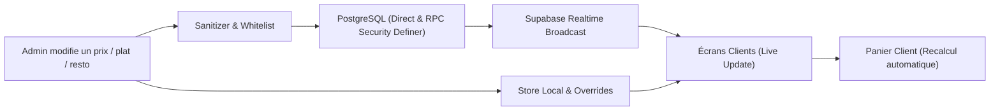
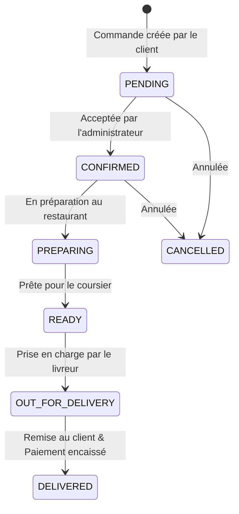

# 🛵 Quick Livraison — Application Mobile de Livraison (Style Glovo)

> **Quick Livraison** est une application mobile et web complète de commande et de livraison à domicile (repas de restaurants, courses de supermarché, boutiques et colis express), optimisée pour le marché marocain (ville pilote : **Oujda**) et extensible à d'autres villes.

Développée avec **React Native**, **Expo** (SDK 54), **TypeScript** et propulsée par **Supabase**, elle propose une double expérience fluide : une interface **Client** intuitive inspirée des standards internationaux (Glovo, Uber Eats) et un panneau d'administration **Admin** temps réel pour le suivi opérationnel, la mise à jour des prix en direct et la gestion de flotte.

---

## 📑 Table des Matières

1. [Aperçu & Philosophie du Projet](#-aperçu--philosophie-du-projet)
2. [Stack Technologique](#-stack-technologique)
3. [Fonctionnalités Principales](#-fonctionnalités-principales)
   - [Espace Client](#-espace-client)
   - [Espace Administrateur](#-espace-administrateur)
   - [Synchronisation en Temps Réel (Admin ➔ Client)](#-synchronisation-en-temps-réel-admin--client)
   - [Sécurité & Protection contre les Attaques](#-sécurité--protection-contre-les-attaques)
   - [Mode Démo Intégré](#-mode-démo-intégré-zéro-friction)
4. [Architecture du Code](#-architecture-du-code)
   - [Arborescence des Dossiers](#arborescence-des-dossiers)
   - [Système de Routage (Expo Router)](#système-de-routage-expo-router)
   - [Gestion des Données & Services (State Management)](#gestion-des-données--services-state-management)
5. [Installation & Démarrage Rapide](#-installation--démarrage-rapide)
6. [Comptes de Test (Identifiants Démo)](#-comptes-de-test-identifiants-démo)
7. [Base de Données & Migrations Supabase](#-base-de-données--migrations-supabase)
   - [Configuration du Client](#configuration-du-client)
   - [Ordre d'Exécution des Migrations](#ordre-dexécution-des-migrations)
   - [Modèle de Données (Schéma Relationnel)](#modèle-de-données-schéma-relationnel)
8. [Flux Métier : Cycle de Vie d'une Commande](#-flux-métier--cycle-de-vie-dune-commande)
9. [Conventions de Code & Règles d'Or](#-conventions-de-code--règles-dor)
10. [Dépannage & FAQ](#-dépannage--faq)

---

## 🎯 Aperçu & Philosophie du Projet

Le projet a été pensé pour être :
* **Temps Réel & Réactif** : Toute modification de prix, de plat ou de statut effectuée dans l'Admin est immédiatement visible côté Client grâce à Supabase Realtime et un système d'overrides locaux.
* **Prêt à l'emploi (Zero Setup Barrier)** : Fonctionne immédiatement en mode démo avec des données locales riches même sans connexion Supabase active.
* **Sécurisé par Défaut** : Protection intégrée contre le brute force, validation et assainissement des entrées, et procédures PostgreSQL `SECURITY DEFINER`.
* **Robuste & Isomorphe** : Compatible **Android**, **iOS** et **Web (navigateur)** sans régression d'interface.
* **Adapté au Contexte Local** : Devise en Dirham marocain (DH / MAD), sélection des quartiers réels d'Oujda (Hay Al Qods, Lazaret, Centre-Ville, etc.), moyens de paiement adaptés (Espèces à la livraison, Virement, Carte).

---

## 🛠 Stack Technologique

| Domaine | Technologies | Rôle & Justification |
| :--- | :--- | :--- |
| **Framework Mobile** | [React Native](https://reactnative.dev/) + [Expo](https://expo.dev/) (SDK 54) | Développement cross-platform natif rapide et performant. |
| **Langage** | [TypeScript](https://www.typescriptlang.org/) (Strict Mode) | Typage statique fort pour sécuriser le code (0 erreur avec `npx tsc --noEmit`). |
| **Routage** | [Expo Router](https://docs.expo.dev/router/introduction/) v6 | Routage basé sur le système de fichiers (File-based Routing), Deep Linking et Route Groups. |
| **BaaS / Base de données** | [Supabase](https://supabase.com/) | PostgreSQL hébergé, authentification JWT, Row Level Security (RLS) et Realtime Channels. |
| **Edge Functions** | Deno / Supabase Functions | Envoi d'OTP WhatsApp pour l'authentification sans mot de passe. |
| **Sécurité & Protection** | Rate Limiter + Input Sanitizer | Blocage des abus par force brute et nettoyage strict des données entrantes. |
| **Stockage Local** | `expo-secure-store` / `localStorage` | Persistance sécurisée des sessions et cache offline selon la plateforme (Mobile/Web). |
| **UI & Animations** | `react-native-reanimated`, `react-native-safe-area-context` | Composants UI personnalisés et animations fluides. |
| **Géolocalisation & Cartes** | `expo-location` + Module GPS interactif | Simulation haute précision du trajet coursier rue par rue. |

---

## ✨ Fonctionnalités Principales

### 👤 Espace Client

1. **Écran d'Accueil (Glovo Hub)** :
   - Sélecteur de quartier de livraison avec géolocalisation GPS automatique ou manuelle (20+ quartiers d'Oujda).
   - 5 bulles de services interactives : *Restaurants*, *Courses/Supermarché*, *Boutiques*, *Pharmacie*, *Service Coursier Colis*.
   - Widget dynamique « Commande en cours » affichant l'état et l'heure estimée avec accès direct au suivi.
   - Compteur en direct des restaurants ouverts dans la ville.
2. **Exploration des Restaurants & Menus** :
   - Catalogue réel des snacks et restaurants d'Oujda (Pizza Hut, BroFood, Chawarma Oujda, Tacos de Lyon, Pasticcio...).
   - Filtres thématiques (*Tous, Promotions, Shawarma & Tacos, Burgers, Pizzas, Plats Marocains, Desserts*).
   - Fiche restaurant avec temps de livraison, note, frais de port dynamiques et badges promo.
   - Fiche produit personnalisable : choix obligatoire de la boisson, choix des sauces gratuites (jusqu'à 2), suppléments gourmands payants et instructions spéciales.
3. **Catalogue Produits / Supermarché** :
   - Recherche textuelle instantanée, filtrage par catégories, fiches détaillées avec gestion du stock.
4. **Panier Intelligent & Réactif** :
   - Bouton flottant de panier visible sur tous les écrans.
   - **Synchronisation automatique des prix** : si un admin modifie le tarif d'un article, son prix unitaire et le total du panier sont recalculés en direct.
   - Calcul automatique du sous-total, des frais de livraison et de la gratuité (dès 100 DH ou avantage fidélité).
   - Choix du mode : **Livraison à domicile** ou **À emporter (Click & Collect)**.
   - Application de codes promo (réductions en % ou montant fixe).
5. **Tunnel de Commande (Checkout)** :
   - Sélection ou saisie rapide de l'adresse de livraison.
   - Sélection du moyen de paiement : *Espèces à la livraison (Cash on Delivery)*, *Virement bancaire*, *Carte bancaire*.
   - Récapitulatif clair et validation en 1 clic.
6. **Suivi en Temps Réel & Carte GPS Interactive** :
   - Frise chronologique visuelle à 5 étapes (*Reçue ➔ Confirmée ➔ En cuisine ➔ En livraison ➔ Livrée*).
   - **Modal de tracking GPS live** : parcours coursier animé étape par étape sur la carte d'Oujda (du restaurant jusqu'au quartier client) avec estimation du temps d'arrivée (ETA), vitesse et nom de la rue en cours.
   - Bouton d'appel direct du livreur assigné.
   - Formulaire d'avis et notation (étoiles + commentaire) une fois la commande livrée.

---

### 🛡️ Espace Administrateur

1. **Tableau de Bord & Métriques (Dashboard)** :
   - Indicateurs de performance (KPIs) : Total des ventes (DH), Commandes actives, Panier moyen, Taux de succès.
   - Classement des plats et articles les plus vendus (Top Ventes).
   - Vue rapide sur les livreurs en service et les codes promotionnels actifs.
   - Synchronisation automatique toutes les 3 secondes + écouteur temps réel Supabase.
2. **Gestion des Commandes** :
   - Filtrage par statut (*Toutes, En attente, En cours, Livrées, Annulées*).
   - Avancement rapide du statut en un clic.
   - Attribution/Assignation dynamique d'un livreur à une commande.
   - Consultation des détails complets (articles, options choisies, coordonnées client, notes).
3. **Gestion des Restaurants & Plats (Temps Réel)** :
   - Édition complète des établissements : nom, cuisine, frais de livraison, horaires, statut ouvert/fermé.
   - Édition des plats : nom, prix en DH, catégorie, description, photo, top des ventes et disponibilité.
   - Propagation immédiate vers les clients connectés.
4. **Gestion du Supermarché** :
   - Bouton d'édition rapide (✏️) et modale complète d'édition de produit (Nom, Prix en DH, Stock, Description).
5. **Gestion de la Flotte de Livreurs** :
   - Liste des coursiers, statut de disponibilité, véhicule (Scooter/Voiture), nombre de courses en cours.

---

### ⚡ Synchronisation en Temps Réel (Admin ➔ Client)

L'application intègre une architecture de synchronisation à triple garantie :



* **Whitelist stricte des colonnes** : Seules les colonnes existant en base sont envoyées, éliminant les erreurs `400 Bad Request`.
* **Procédures stockées `SECURITY DEFINER`** : `rpc_update_restaurant`, `rpc_update_menu_item`, `rpc_update_product` garantissent l'enregistrement des modifications même sans compte admin pré-authentifié.
* **Registre d'Overrides Locaux** : Aucune mise à jour locale n'est écrasée par une ancienne version de la base de données.
* **Synchronisation du Panier** : Le panier recalcule instantanément le sous-total et les frais de livraison dès qu'un tarif change.

---

### 🛡️ Sécurité & Protection contre les Attaques

* **Rate Limiting Client & Base (`lib/rateLimiter.ts`)** :
  - Protection contre les attaques par force brute (connexion, OTP WhatsApp, création abusive de commandes, requêtes API répétées).
* **Nettoyage et Assainissement des Entrées (`lib/sanitize.ts`)** :
  - Élimination des balises HTML, scripts XSS et caractères malveillants sur les noms, adresses, descriptions et numéros de téléphone.
* **Protection contre la manipulation de prix** :
  - Les prix et totaux sont validés et recalculés côté serveur lors de la soumission de commande.
* **Ségrégation stricte des Rôles (RLS)** :
  - Empêche l'escalade de privilèges (Client ➔ Admin, Livreur ➔ Admin).

---

### 🚀 Mode Démo Intégré (Zéro Friction)

L'application intègre un mécanisme de repli (**fallback demo mode**) :
* Si les clés Supabase ne sont pas configurées ou en cas de coupure réseau, l'application **ne plante jamais**.
* Elle bascule de manière transparente sur des données de démonstration interactives stockées localement (`mockData.ts`, `localStorage` / `SecureStore`).
* Les commandes passées par le client apparaissent instantanément dans l'interface administrateur (même sur deux onglets de navigateur distincts via le système d'événements `storage`).

---

## 📂 Architecture du Code

### Arborescence des Dossiers

```
App-livraison-/
│
├── app/                              # Pages et routage (Expo Router)
│   ├── _layout.tsx                   # Layout racine : polices, auth guard, redirection par rôle
│   ├── (auth)/                       # Écrans d'authentification
│   │   ├── login.tsx                 # Connexion (avec boutons d'accès rapide démo)
│   │   ├── register.tsx              # Inscription nouveau compte
│   │   ├── otp.tsx                   # Validation OTP WhatsApp
│   │   ├── forgot-password.tsx       # Réinitialisation mot de passe
│   │   └── legal-terms.tsx           # Conditions générales et mentions légales
│   │
│   └── (app)/                        # Écrans protégés
│       ├── (client)/                 # Espace Client
│       │   ├── (tabs)/               # Barre d'onglets (Accueil, Catalogue, Panier, Commandes, Profil)
│       │   │   ├── index.tsx         # Accueil Glovo Hub & Quartiers d'Oujda
│       │   │   ├── catalog.tsx       # Supermarché / Produits (Sync temps réel)
│       │   │   ├── cart.tsx          # Gestion du Panier & Code Promo
│       │   │   ├── orders.tsx        # Historique & Suivi des commandes
│       │   │   └── profile.tsx       # Profil, Adresses, Paramètres
│       │   ├── checkout.tsx          # Tunnel de paiement et validation finale
│       │   ├── restaurants/
│       │   │   └── index.tsx         # Liste et recherche des restaurants
│       │   └── restaurant/
│       │       └── [id].tsx          # Menu du restaurant & personnalisation
│       │
│       ├── (admin)/                  # Espace Administrateur
│       │   ├── (tabs)/
│       │   │   ├── index.tsx         # Tableau de bord analytique
│       │   │   ├── orders.tsx        # Gestion et affectation des commandes
│       │   │   ├── products.tsx      # Gestion des restaurants, plats et supermarché
│       │   │   ├── categories.tsx    # Gestion des catégories
│       │   │   └── profile.tsx       # Profil admin
│       │   └── _layout.tsx
│       │
│       └── product/
│           └── [id].tsx              # Fiche détaillée produit / plat
│
├── components/                       # Composants d'interface réutilisables
│   └── ui/
│       ├── Button.tsx                # Bouton standardisé (variants, loading)
│       ├── Input.tsx                 # Champ de saisie stylisé
│       ├── Card.tsx                  # Carte conteneur avec ombrage
│       ├── CartFloatingButton.tsx    # Bouton flottant panier avec badge
│       ├── LiveTrackingMapModal.tsx  # Modal de tracking GPS live haute précision
│       ├── MenuItemRow.tsx           # Ligne de plat de restaurant
│       ├── OrderTimeline.tsx         # Barre de progression de commande
│       └── RestaurantCard.tsx        # Carte restaurant avec badges et notes
│
├── constants/                        # Données statiques & configurations
│   ├── Colors.ts                     # Palette de couleurs (Thème Quick Livraison)
│   ├── Maps.ts                       # Configuration cartographique
│   ├── glovoRestaurants.ts           # Catalogue complet des snacks & restaurants d'Oujda
│   └── mockData.ts                   # Quartiers d'Oujda, statuts, données de test
│
├── lib/                              # Clients tiers, sécurité et utilitaires
│   ├── env.ts                        # Accesseur centralisé des variables d'environnement
│   ├── rateLimiter.ts                # Protection rate limiting anti-brute-force
│   ├── sanitize.ts                   # Assainissement et nettoyage des entrées (Anti-XSS/SQLi)
│   └── supabase.ts                   # Client Supabase & adaptateur de session sécurisé
│
├── services/                         # Logique métier & communication données
│   ├── address.service.ts            # Gestion des adresses utilisateurs
│   ├── admin.service.ts              # Statistiques du tableau de bord
│   ├── auth.service.ts               # Authentification, sessions et rôles
│   ├── cart.service.ts               # Panier intelligent avec mise à jour des prix en direct
│   ├── courier.service.ts            # Flotte de livreurs
│   ├── order.service.ts              # Cycle de vie des commandes & Sync temps réel
│   ├── product.service.ts            # Catalogue produits avec écouteurs Realtime
│   └── restaurant.service.ts         # Restaurants, menus, options et synchronisation live
│
├── supabase/                         # Schémas et migrations PostgreSQL
│   ├── functions/whatsapp-otp/       # Edge Function d'envoi d'OTP WhatsApp
│   └── migrations/                   # Migrations ordonnées par date
│
├── types/                            # Définitions des types TypeScript
├── package.json                      # Dépendances du projet
└── tsconfig.json                     # Configuration TypeScript stricte
```

---

## ⚡ Installation & Démarrage Rapide

### 1. Prérequis
* [Node.js](https://nodejs.org/) (v18 ou supérieur)
* [npm](https://www.npmjs.com/) ou [yarn](https://yarnpkg.com/)
* Application [Expo Go](https://expo.dev/go) sur smartphone (Android/iOS) pour tester sur mobile physique.

### 2. Cloner et Installer les dépendances
```bash
# Cloner le dépôt
git clone https://github.com/yassinechidm/App-livraison-.git
cd App-livraison-

# Installer les dépendances
npm install
```

### 3. Configurer l'environnement
Créez un fichier `.env` à la racine à partir de `.env.example` :
```env
EXPO_PUBLIC_SUPABASE_URL=https://<votre-projet>.supabase.co
EXPO_PUBLIC_SUPABASE_ANON_KEY=<votre-cle-publique-anon>
EXPO_PUBLIC_GOOGLE_MAPS_API_KEY=<votre-cle-google-maps>
```

### 4. Lancer le serveur de développement
```bash
# Démarrer Expo Metro Bundler
npm start
```

* **Web** : Appuyez sur `w` ou lancez `npm run web`.
* **Android** : Appuyez sur `a` (émulateur Android ou USB).
* **iOS** : Appuyez sur `i` (macOS avec simulateur Xcode).
* **Mobile physique** : Scannez le QR Code avec **Expo Go**.

### 5. Vérifier la compilation TypeScript
```bash
npx tsc --noEmit
```
*(Le projet doit compiler avec 0 erreur).*

---

## 🔑 Comptes de Test (Identifiants Démo)

Des comptes prédéfinis permettent de tester instantanément les deux rôles :

| Espace | Email | Mot de passe | Rôle | Accès Rapide |
| :--- | :--- | :--- | :--- | :--- |
| **Administrateur** | `admin@quicklivraison.ma` | `123456` | `ADMIN` | Bouton « Connexion Démo Admin » |
| **Client** | `client@quicklivraison.ma` | `123456` | `CLIENT` | Bouton « Connexion Démo Client » |

---

## 🗄 Base de Données & Migrations Supabase

### Ordre d'Exécution des Migrations

Pour déployer la base complète sur votre projet Supabase, rendez-vous dans le **SQL Editor** de Supabase et exécutez les migrations dans l'ordre :

1. `supabase/migrations/20260910000000_canonical_schema.sql` : Structure des tables de base (`profiles`, `couriers`, `categories`, `products`, `restaurants`, `restaurant_menu_items`, `orders`).
2. `supabase/migrations/20260910000001_secure_roles_and_rls.sql` : Politiques RLS et rôles sécurisés.
3. `supabase/migrations/20260910000002_rpc_create_order.sql` : Procédure atomique de création de commande.
4. `supabase/migrations/20260910000003_realtime_gps_dispatch.sql` : Dispatch livreurs et coordonnées GPS live.
5. `supabase/migrations/20260916000000_rate_limiting_and_input_cleaning.sql` : Tables et compteurs de rate limiting.
6. `supabase/migrations/20260916000001_security_hardening_attacks.sql` : Règles de sécurité anti-attaques.
7. `supabase/migrations/20260916000002_seed_glovo_oujda_snacks.sql` : Injection de l'ensemble des restaurants et snacks d'Oujda.
8. `supabase/migrations/20260916000003_allow_admin_product_and_menu_updates.sql` : Procédures `SECURITY DEFINER` (`rpc_update_restaurant`, `rpc_update_menu_item`, `rpc_update_product`), ouverture des droits d'écriture Admin et publication Supabase Realtime.

---

## 🔄 Flux Métier : Cycle de Vie d'une Commande



---

## 📏 Conventions de Code & Règles d'Or

1. **TypeScript Strict** :
   - Strict mode actif. Aucun type `any` non contrôlé. Types déclarés dans `types/`.
2. **Architecture sans Serveur Intermédiaire** :
   - Logique serveur encapsulée dans PostgreSQL (RPCs, Triggers, RLS) et Edge Functions.
3. **Whitelist des Données Envoyées en Base** :
   - Ne jamais faire de `...updates` aveugle vers Supabase ; filtrer systématiquement les champs pour prévenir les erreurs de schéma (`400 Bad Request`).
4. **Isomorphisme Mobile & Web** :
   - Garantir un rendu parfait sur écran tactile mobile et sur navigateur desktop.

---

## ❓ Dépannage & FAQ

### 1. Erreur « Could not find the 'opening_hours' column of 'restaurants' »
Exécutez la migration `supabase/migrations/20260916000003_allow_admin_product_and_menu_updates.sql` dans le SQL Editor de Supabase pour ajouter la colonne et recharger le cache PostgREST (`NOTIFY pgrst, 'reload schema'`).

### 2. Réinitialiser le cache Expo en cas de bug d'affichage
```bash
npx expo start -c
```

### 3. Les modifications de prix n'apparaissent pas sur un autre appareil
Vérifiez que la publication Realtime est bien active sur Supabase en ré-exécutant la migration `20260916000003_allow_admin_product_and_menu_updates.sql`.

---

## 👥 Licence & Contribution

Projet sous licence MIT — Développé avec passion pour le commerce de proximité et la livraison rapide au Maroc 🇲🇦.
